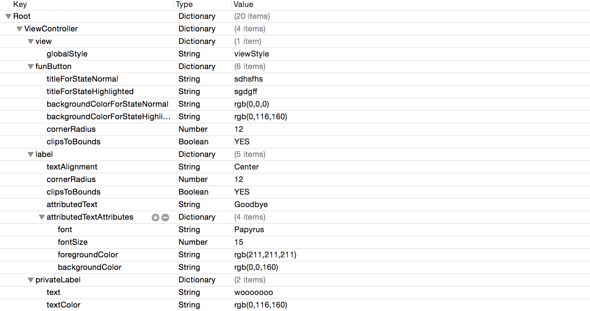
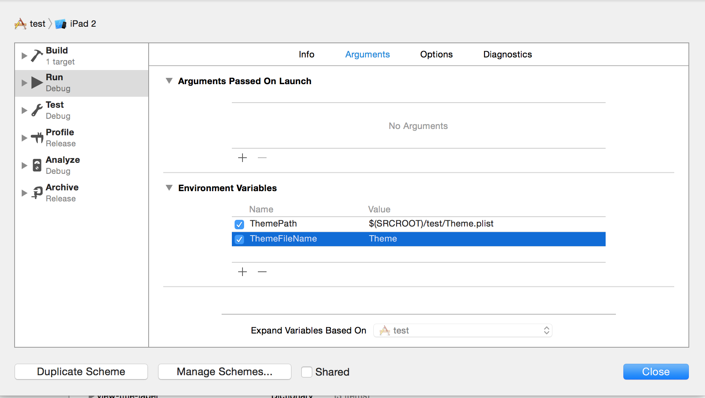
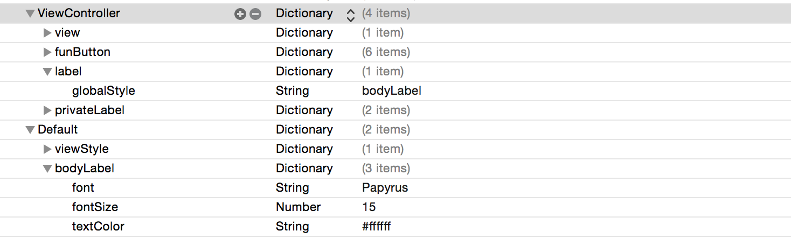

ThemeKit
===========
A protocol that allows attributes like fonts, colors, corner radii and such to be applied through a plist, with virtually no code needed to be written in app to support it. Also supports live theming, so changes made to the plist at runtime are reflected in the app immediately. The plist stuff is a port of [DB5](https://github.com/quartermaster/DB5), and the live theming idea is taken from [Pixate](https://github.com/Pixate/pixate-freestyle-ios).

[](https://github.com/Carthage/Carthage)

Usage
===========
There is one protocol that you need to conform to, `Themable`. There are no methods to implement, and you only need to call `applyTheme()` whenever you want attributes to be applied, and optionally, `registerForThemeChanges()` if you want to be able to support live updating of the theme plist.


```swift
class ViewController: UIViewController, Themable {
    @IBOutlet var funButton: UIButton!

    @IBOutlet var label: UILabel!
    private var privateLabel:UILabel = UILabel()

    override func viewDidLoad() {
        super.viewDidLoad()
        registerForThemeChanges()
        applyTheme()
    }
}
```
The plist follows a convention, and for the above code you would have something like this:



where each object that conforms to `Themable` has an entry in the plist, and each property of the `Themable` object has an entry with the desired attributes.

There are two ways to set the name of the plist. The first is so set it as an environment variable, like so:



The second is to extend `Themable` and implement `themeFileName:String?` so it looks something like this:

```swift
extension Themable {
    var themeFileName:String? {
        return "YourPlistName"
    }
}
```
You can also override the default theme name for objects that conform to `Themable` by implementing the `themeName` property like so:

```swift
class ViewController: UIViewController, Themable {
    var themeName:String? {
        return "CustomThemeName" // if you don't want to use "ViewController" as a name in the plist
    }
}
```

Global Styles
===========
To avoid duplication, you can specify global styles, rather than repeating attributes for similarly styled items. These global styles go under a dictionary in the plist named `Default` and can be referenced for any property with the `globalStyle` key, where the value is the key of the style you are referencing from the `Default` dictionary. that looks like this:




Live Changes
===========
To be able to change the theme at runtime, you need to call `ThemeWatcher.sharedInstance.watch()` in your app delegate. You also need to specify the path to the plist file on your mac in an environment variable named `ThemePath`. That looks like this:


With this implemented, you can change values of the plist while the app is running in the simulator, and the changes will be immediately reflected in the app.

You should only use the ThemeWatcher in debug mode on the simulator, so you should wrap it in something like this:

```swift
if DEBUG {
    ThemeWatcher.sharedInstance.watch()
}
```

Implementation
===========
ThemeKit Uses default protocol implementations and reflection to work its magic. There is no swizzling or any other type of skulduggery going on behind the scenes that would cause you consternation.

This does mean that each themable property has to have an Implementation behind it, which looks like this: `case .backgroundColor: self.backgroundColor = theme.colorForKey(key)`. So if you find something that is not implemented that you would like implemented, PR's are welcome.


Supported Properties
===========
###UIView
* backgroundColor
* alpha
* cornerRadius
* borderColor
* borderWidth
* tintColor
* clipsToBounds
* shadowRadius
* shadowColor
* shadowOpacity

###UILabel
* font
* fontSize* must be specified, or font size of `font` property defaults to 15
* textColor
* text
* textAlignment
* attributedText
  * attributedTextAttributes
    * font
    * fontSize* must be specified, or font size of `font` property defaults to 15
    * foregroundColor
    * backgroundColor

###UIButton
* titleForStateNormal
* titleForStateHighlighted
* titleForStateSelected
* titleForStateDisabled
* titleColorForStateNormal
* titleColorForStateHighlighted
* titleColorForStateSelected
* titleColorForStateDisabled
* titleShadowColorForStateNormal
* titleShadowColorForStateHighlighted
* titleShadowColorForStateSelected
* titleShadowColorForStateDisabled
* imageForStateNormal
* imageForStateHighlighted
* imageForStateSelected
* imageForStateDisabled
* backgroundImageForStateNormal
* backgroundImageForStateHighlighted
* backgroundImageForStateSelected
* backgroundImageForStateDisabled
* backgroundColorForStateNormal
* backgroundColorForStateHighlighted
* backgroundColorForStateSelected
* backgroundColorForStateDisabled

###UIImageView
* image
* highlightedImage
* highlighted

###UITextField
* text
* attributedText
* placeholder
* attributedPlaceholder
* font
* fontSize* must be specified, or font size of `font` property defaults to 15
* textColor
* textAlignment
* borderStyle
* background
* disabledBackground

###UINavigationBar
* barTintColor
* shadowImage
* backIndicatorImage
* backIndicatorTransitionMaskImage
* translucent
* titleTextAttributes
* backgroundImageForBarMetricsDefault
* backgroundImageForBarMetricsCompact

###UITableView
* rowHeight
* separatorColor
* separatorStyle
* separatorInset


More coming soon!

Installation
===========
You can install ThemeKit with [Carthage](https://github.com/Carthage/Carthage) by putting `github "tLewisii/ThemeKit" "master"` into your Cartfile.
